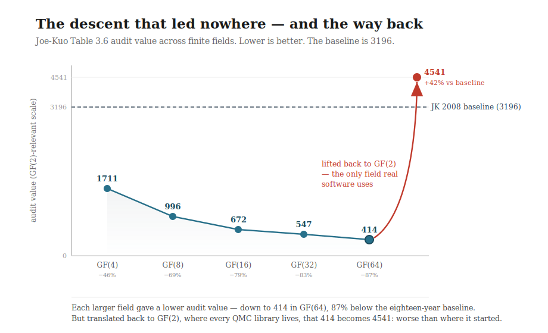

# Proyecto Estrella · Sobol Campaign

**The first ratified improvement over the Joe-Kuo (2008) Table 3.6 audit metric in 18 years — and an empirical refutation of the single-basin-optimum assumption in F₂ Sobol direction numbers.**

**Author**: Rafael Amichis Luengo (Madrid) · **Date**: May 2026 · **Status**: closed project, open dataset · **License**: MIT

---

## What this is, in one breath

Sobol' quasi-Monte Carlo sequences are the most widely deployed low-discrepancy sequences in industry — scipy, BoTorch, MATLAB QRNG, NAG, QuantLib, computer graphics, machine learning, computational finance. Their quality is governed entirely by a set of **direction numbers**, and the de facto standard for the last eighteen years has been the Joe & Kuo (2008) construction. Nobody had published a ratified improvement on its own audit metric since.

This project did, on a MacBook Air. It is the record of one psychologist, a single M2 chip running at 25% of one core, and a few dozen search engines with deliberately ridiculous names, doing what eighteen years of the field had not — and then, with the same engines, discovering *why the whole enterprise is subtler than it looks*.

Two contributions came out of it:

1. **A reproducible record**: `COMBO_3027` (audit = 3027), a **−5.3 % improvement** over the published Joe-Kuo baseline (audit = 3196), re-derivable byte-exact from a clean-room Python re-implementation of the audit recurrence.

2. **A finding that refutes a standard implicit assumption**: the F₂ audit subspace does *not* contain a single audit-optimum. It contains **multiple sub-baseline basins with functionally specialised integration-error profiles**. The right direction numbers depend on the *shape of your integrand*, not on the audit number alone. (Full statement in [`MAIN_DISCOVERIES.md`](MAIN_DISCOVERIES.md).)

The entire pipeline — six C++ search engines, an incremental audit cache with rollback, parallel-tempering simulated annealing, empirical move-productivity probes, a quadruple-verify protocol — and every dump and log used to produce the record are in this repository, so anybody can reproduce, audit, and extend.

---

## The detour that taught the lesson: a walk down a road no one travels

Before the record came a long, deliberate descent through fields nobody else was searching — and the most important scientific result of the project came from finding out, the hard way, that it was the wrong mountain.

The Joe-Kuo construction lives over **GF(2)** — the binary field. The natural conjecture, the one any optimiser would reach for, was: *if the binary field is so cramped, go to a bigger field. More room, more freedom, lower numbers.* So the campaign climbed. GF(4), GF(8), GF(16), GF(32), GF(64). New kernel for each, new arithmetic, new everything, all taught from scratch by someone who had never opened a coding-theory textbook.

And the numbers fell. Spectacularly. Each field was a new descent, each engine a multi-day run on the M2:

| Field | Best engine | Audit | vs JK_2008 | M2 wall-clock |
|---|---|---:|---:|---:|
| GF(4) | TOGORDOESPORMISHUEVOS1666 | 1711 | −46 % | 387 min |
| GF(8) | SANGORDORTOGORDOLETALPMC | 996 | −69 % | 18.3 h |
| GF(16) | TOGORDOESELMASGORDOYADEMASELREYMASGORDO | 672 | −79 % | 24.0 h |
| GF(32) | TOGORDOELGRANGRASIENTOESELREYQUEGANALENTO | 547 | −83 % | 44.7 h |
| GF(64) | TRINCANERO (engine 11) | 414 | −87 % | — |

Eighty-seven percent below the eighteen-year baseline. Weeks of work. Engines that ran for two full days each. A number that, on its face, looked like a demolition of the state of the art.

Then the only honest question left was asked: **does this actually help anyone integrate anything faster?** To answer it, the GF(64) record was lifted back to GF(2) via the canonical regular representation of the field — the form any real software (scipy, QuantLib, BoTorch) would actually need — and benchmarked on the Genz integration test functions against plain Joe-Kuo.

The answer was no. Lifted to GF(2), the celebrated `414` becomes a GF(2) t-value of **4541 — forty-two percent *worse* than Joe-Kuo**. On standard Genz integrals the lifted matrices lost 11–12 of 15 cells, with integration error 4× to 85× worse. The field records were mathematically real **inside their own fields**, and worthless to a practitioner outside them. **GF(q) and GF(2) t-values are not monotonically related** — driving one down says nothing reliable about the other.

That is the finding. Not a footnote, the centre of gravity. The descent to `414` was a beautifully optimised walk down a path that leads nowhere anyone needs to go, because no working QMC code lives in GF(64), and the bridge back to GF(2) destroys exactly the structure that was optimised. The record was a postcard from a country with no roads in.



So the project closed the GF(q) track honestly — the five field records are preserved here as a legitimate, self-contained exploration of higher-cardinality digital-net theory, clearly labelled as *not* practitioner-relevant — turned around, and walked back to GF(2) to attack the only metric that governs real integration error, this time carrying every lesson the detour had paid for. That return is where `COMBO_3027` and the basin-diversity finding live.

The errors are not hidden in this repository. They are the load-bearing structure. The wrong mountain is what made the right map readable.

---

## The record at a glance

| Construction | Audit (JK Table 3.6) | Δ vs JK_2008 | Genz wins (6 fns × 3 dims) | Best for |
|---|---:|---:|---:|---|
| **JK_2008** (Joe & Kuo, 2008) | 3196 | — | (baseline) | continuous, corner-peak |
| **COMBO_3027** (project record) | **3027** | **−5.3 %** | **7 / 18** | oscillatory, product-peak (dim ≥ 20) |
| **E17_seed4_3095** (alternative basin) | 3095 | −3.16 % | 6 / 18 | **Gaussian, dim ≥ 20** |

All three are included as plain-text dumps and re-verified in seconds with the supplied Python verifier. No single one of them dominates Joe-Kuo across every integrand family — that non-domination *is* the second contribution.

---

## Verify the record in two minutes

Requirements: Python 3.9+, `numpy`, `scipy`, `qmcpy 2.2+`.

```bash
git clone https://github.com/tretoef-estrella/proyecto-estrella-sobol
cd proyecto-estrella-sobol

# Re-derive the project record (audit = 3027)
python3 verify_F2_independent.py TOGORDO_COMBO_v1_RECORD.txt
# → Expected: audit = 3027

# Re-derive the Joe-Kuo (2008) baseline (audit = 3196)
python3 verify_F2_independent.py new-joe-kuo-6.21201
# → Expected: audit = 3196

# Genz integration-error benchmark (~5 min, single thread)
python3 genz_benchmark_COMBO_vs_JK.py TOGORDO_COMBO_v1_RECORD.txt new-joe-kuo-6.21201
# → Expected: COMBO_3027 wins 7/18 cells, family-specialised

# Independent cross-check: t-values by box counting on qmcpy-generated points
python3 verify_qmcpy_independent.py                       # baseline, fully independent
python3 verify_qmcpy_independent.py TOGORDO_COMBO_v1_RECORD.txt
# → both routes agree on the box-countable range (see verification note below)
```

**A note on verification rigour, stated plainly.** The record is verified along **two independent routes**, and they agree.

1. `verify_F2_independent.py` is a clean-room re-implementation in a different language with the opposite bit-packing direction. It catches the entire class of *implementation* bugs (dump parsing, off-by-one, indexing). On its own it is a *redundancy* verifier: it shares the Joe-Kuo `m_k` recurrence and the Niederreiter rank predicate with the C++ kernel, so it could not catch a *specification* error common to both.

2. `verify_qmcpy_independent.py` closes that gap where it matters most — the t-value. It generates the actual Sobol points with the third-party library `qmcpy` (independently maintained, no shared code with this project) and recovers each t-value **geometrically, by counting points in dyadic boxes** — the physical *meaning* of the t-value — instead of re-computing the rank formula. For the Joe-Kuo baseline it even takes the generating matrices from qmcpy's own internal tables, sharing no specification at all.

The two routes were cross-checked on the same range (audit over m ∈ [5, 14], Joe-Kuo baseline): **both return 1373, exactly.** Rank-based and equidistribution-based t-values agree. The one residual is that, for project dumps, the matrices are still built from the shared recurrence (box counting only replaces the t-value computation); a fully independent *construction* of the direction numbers does not exist in the literature in a different form. The two verifiers together cover both surfaces — matrix construction and t-value — and neither alone would. The record is honest about exactly how far each route reaches.

---

## How to use this work as a practitioner

If your integrands are **oscillatory or product-peak** (Fourier-domain methods, multiplicative-payoff pricing, simulations with rapid modes) and you work in dimension ≥ 20, use `TOGORDO_COMBO_v1_RECORD.txt` in place of `new-joe-kuo-6.21201`.

If your integrands are **Gaussian-type in dim ≥ 20** (Bayesian posterior expectations, certain ML hyperparameter problems), use `togordo17_seed3_dump.txt` (audit = 3095, the alternative basin).

If your integrands are **smooth, continuous, or corner-peak**, the canonical Joe-Kuo (2008) construction is still your best choice on this benchmark.

[`GUIDE_FOR_EVERYONE.md`](GUIDE_FOR_EVERYONE.md) walks through all of this in plain language, including a worked example of loading any of the three direction-number sets into `scipy.stats.qmc.Sobol`.

---

## Repository contents

All files live in the root. No nested folders.

**Records (the direction numbers themselves):**
- `TOGORDO_COMBO_v1_RECORD.txt` — the project record (audit = 3027), oscillatory / product-peak specialist · *included*
- `togordo17_seed3_dump.txt` — alternative basin (audit = 3095), Gaussian dim ≥ 20 specialist · *included*
- `new-joe-kuo-6_21201.md` — Joe-Kuo (2008) baseline (audit = 3196) · *included* (markdown wrapper, first 37 dimensions; the full 21201-dim official file is at https://web.maths.unsw.edu.au/~fkuo/sobol/ as `new-joe-kuo-6.21201`)

**Verifiers:**
- `verify_F2_independent.py` — D190 step-4 redundancy verifier (clean-room Python; see the verification note above)
- `genz_benchmark_COMBO_vs_JK.py` — Genz benchmark, six integrand families × three dimensions

**C++ kernel (the engine):**
- `ESTRELLA_GF2_KERNEL.h` — canonical F₂ audit-metric kernel
- `AUDIT_CACHE.h` — incremental cache with `CacheDiff` rollback (65× speedup measured on single-thread M2)
- `JK_BUILDER.h` — Joe-Kuo-spec slot construction

**Search engines (final closure cycle):**
- `togordoeldesheredado.cpp` — Engine 17 (4-seed cold-start cross-genealogy campaign; produced the 3095 alternative basin)
- `togordoelsupergordoinfiel.cpp` — Engine 18 (Move P1 chained recovery + multi-init)

Engines 13–16 of the early F₂ cycle are fully specified architecturally in `PAPER_TERMINAL.md` §217–§222 (the basin-saturation evidence under the COMBO genealogy); their sources are omitted because the closure engines 17–18 supersede them in arsenal and discipline. The GF(q) field engines and their preserved record dumps are documented in the same paper, clearly marked as the closed, non-practitioner-relevant exploration described above.

**Documents:**
- `README.md` — this file
- `MAIN_DISCOVERIES.md` — the four scientific contributions, concise and citable
- `NEW_DISCOVERIES.md` — open journal for post-closure findings (empty at release)
- `PAPER_TERMINAL.md` — full project paper, lossless, ~3700 lines, every engine documented including the GF(q) detour and the Genz refutation
- `COJONES_SABIOS_TERMINAL.md` — operational arsenal: 12 Sobol-native levers with empirical-applicability annotations
- `METHODOLOGY.md` — standalone methods primer (quadruple-verify, incremental cache, productivity probe)
- `GUIDE_FOR_EVERYONE.md` — plain-language tour
- `CITATION.cff` — machine-readable citation
- `LICENSE` — MIT

**Analytical reference data:**
- `BOUND_COMPUTE_v1_log.txt` — analytical floors on the audit subspace (with the caveat — see `MAIN_DISCOVERIES.md` — that its cross-dimension independence assumption is structurally false, which is itself one of the project's findings)
- `PISO_TEORICO_v1_log.txt` — absolute / real floor measurements
- `RESULTADOS_FORENSIC.txt` — FORENSIC v1 structural priors (frozen slots, couplings, the co-changing sextet)
- `primitive_polynomials_deg8.md`, `primitive_polynomials_deg9.md` — primitive polynomial reference data

**Engine campaign logs (raw, reproducible):**
- `togordo13_v2_log.txt`, `togordo14_log.txt`, `togordo15_log.txt`, `togordo16_log.txt` — F₂ early cycle (Engines 13–16, all closed with audit-Δ = 0 over the COMBO genealogy — the saturation evidence)
- `togordo17_log.txt` — Engine 17 full campaign (4 seeds, best = 3095, ~33 h M2)
- *(Engine 18 log not included: the run was terminated mid-campaign by the Architect after seed-3 closure, once the substantive findings — F86 basin diversity, Move P1 ornamental in F₂ — were established. Rationale in `PAPER_TERMINAL.md` §226.2.)*

---

## What this repository is, and what it isn't

**It is**: a complete, reproducible record of one of the rare improvements over the Joe-Kuo (2008) Sobol direction numbers on their own audit metric, together with the empirical evidence that the F₂ audit subspace is structured into multiple basins with distinct integration-error profiles — refuting an implicit assumption in QMC literature about what audit-metric optimisation means. And it is the honest documentation of a weeks-long descent through higher fields that produced a beautiful, useless number, and the benchmark that proved it useless.

**It is not**: a uniform replacement for Joe-Kuo (2008). The Genz benchmark in this repository makes the limits explicit — the project record beats Joe-Kuo on 7 of 18 cells, not all of them. It is not a claim of formal peer-reviewed verification; it is honest about exactly how far its verifier goes. And the GF(q) field records are not practitioner-relevant, which the repository states wherever they appear rather than burying.

---

## A note on the names

The engines carry deliberately absurd names in Castilian Spanish (`TOGORDOELGRANGRASIENTOESELREYQUEGANALENTO` — "the great greasy one is the king who wins slowly" — closed GF(32) at 547). This is not decoration. It is a working discipline with two distinct justifications.

The first is human: *a ridiculous name is not allowed to survive a mediocre engine.* A name you would be embarrassed to put in a record forces the work under it to be good. The names are the author's signature, and when an engine set a record its name went into the record without apology.

The second is a practitioner's hypothesis, stated honestly as such. Across nearly a thousand engines spanning every project of Proyecto Estrella, the author's consistent working observation is that engines given names with **strong, vivid semantics** — rather than neutral labels like `engine_v7` — were specified, debugged, and iterated more effectively in collaboration with the AI system that wrote them. The working explanation is that a semantically rich name engages parallel associative context in the model, sharpening how it reasons about the engine's purpose and failure modes. This is an empirical impression from extended practice, **not a measured A/B result** — no controlled comparison of neutral-named versus vivid-named engines on identical tasks was run. It is recorded here because it shaped the methodology and because, after a thousand engines, the author trusts the pattern enough to keep doing it. Read it as a hypothesis worth testing, not as an established claim.

---

## Citation

```bibtex
@misc{amichis2026estrella,
  author       = {Amichis Luengo, Rafael},
  title        = {Proyecto Estrella: Empirical characterization of basin
                  diversity in the F\_2 Joe-Kuo Table 3.6 audit subspace,
                  with functional-family-specialised Genz performance profiles},
  year         = {2026},
  month        = may,
  howpublished = {GitHub repository},
  url          = {https://github.com/tretoef-estrella/proyecto-estrella-sobol},
  note         = {Record: COMBO\_3027 (audit 3027, -5.3\% vs JK\_2008);
                  alternative basin E17\_seed4\_3095 (audit 3095, Gaussian dim$\geq$20);
                  GF(q) field-record exploration documented and closed as
                  non-practitioner-relevant per Genz benchmark}
}
```

A machine-readable `CITATION.cff` is included.

---

## Acknowledgements

- **Joe & Kuo (2008)** — the original construction and reference direction numbers.
- **Niederreiter (1987–1988), Owen (1995), Faure & Lemieux (2016)** — foundational work informing the Sobol-native arsenal in `COJONES_SABIOS_TERMINAL.md`.
- **Anthropic / Claude** — AI collaboration in the Architect–Constructor–Auditor working pattern. The Architect (Rafa) arbitrated every decision, set every hypothesis, and ran every M2 job. Claude instances served as Constructor (C++ engines, scripts) and Auditor (forensic dissent against the archives). The triple-role discipline — including the retirements, the retractions, and the symmetric error-logging — is documented in the paper.

---

## Contact

For questions, corrections, or to share results derived from this work, open a GitHub issue. Substantive disagreements and reproducibility reports are especially welcome.

Email: tretoef@gmail.com

---

*Madrid, May 2026 — Cojones rectos.*
